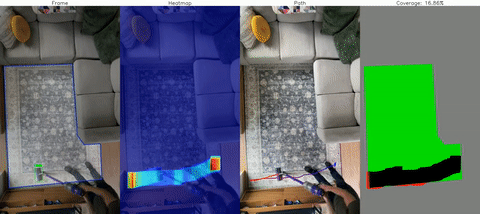

# vacuum-challenge
How good are you at Vacuuming? Let's find out.

This software tracks and visualizes the movement of a vacuum in a given area using an overhead camera feed. It provides a path, heatmap, and coverage map of the vacuum's activity.



## So, what's this all about? 🤔
This project is like giving your vacuum cleaner its very own GPS. Using the power of computer vision (shout out to cv2 and Roboflow!), we track our small roving friend, mapping out its path, the areas it's covered, and even where it hasn’t! Think of it as those car GPS screens you see in movies, but for your vacuum.

Just place a camera overhead (the bird's-eye view is the best view!), let your vacuum go on its cleaning spree, and this program will do the rest. We create a heatmap showing where our little bot hung out the most (was it near the fridge? 🤔), plot the path it took, and even provide a coverage map! So next time, you'll know if it's just chilling in a corner when it's supposed to be working!

Oh, and for the fun part? You get to draw on your first video frame! It's kinda like setting the boundaries for your vacuum. Tell it where you'd like it to go and where it's a no-no. Perhaps keep it away from your cat's favorite spot?

So, buckle up, and let's go on a visual adventure with your vacuum cleaner. Dive into the code, and let's roll (or... glide?). And remember, it's all in good fun! Enjoy!

## Features
1. **Heatmap Visualization**: Shows the frequency of the vacuum's visits to specific areas.
2. **Path Visualization**: Displays the trajectory of the vacuum's movement across the video feed.
3. **Coverage Map**: Differentiates between visited areas, untouched areas inside a user-defined polygon, and areas outside the polygon.
4. **Video Output**: Allows saving the visual outputs into a video file for later review.

## Installation
```bash
# Clone the repository
git clone https://github.com/reedajohns/vacuum-challenge.git
cd vacuum-challenge

# Install required packages (Assuming you use pip and have a requirements.txt)
pip install -r requirements.txt
```

## Usage

1. Ensure your configurations are set in the `config.yaml` file.
2. Run the software:
```bash
python main.py
```
3. On the initial video frame, draw a polygon to define the area you want to focus on.
4. Confirm or redraw the polygon as needed.
5. Let the software process the video feed, detecting the vacuum's movement, and providing visualizations in real-time.

## Configuration
Settings can be adjusted in the `config.yaml` file. Available settings include:
- **Video path**: The path to the video feed.
- **Object to track**: Define the specific object label (e.g., vacuum) that the model should detect.
- **Output settings**: Define whether to save the visualizations as a video and specify the output path.

## Test Subjects (Examples)

### Person 1 Analysis
[](https://www.youtube.com/watch?v=69MfvbTKmzc)

### Person 2 Analysis
[](https://www.youtube.com/watch?v=rFReP_inYKo)

### Robot Vacuum
For some reason my robot vacuum refused to go near the walls, but still interesting to see the path it takes.
[](https://www.youtube.com/watch?v=d0UnBy89NsY)

## Dependencies
- OpenCV
- Roboflow

## Notes
As you can see in the videos, the tracking isn't perfect and improvements would be easy to make. The environment is in my living room with plently of natural light, which can be the enemy of computer vision projects! I also could spend much more time tuning the model, so it's not perfect. I'm sure with a little more time and effort, the results could be improved. But, I think it's a fun project and a good starting point for anyone interested in this type of project.
- Make the model more robust to lighting conditions
- Add more images to the training set
- Smooth the path
- Improve the coverage map to include only the areas of the vacuum, not the entire bounding box.

## Contributions
Feel free to contribute to this project by opening issues or submitting pull requests. All contributions are welcome!

## License
This project is licensed under the MIT License.
